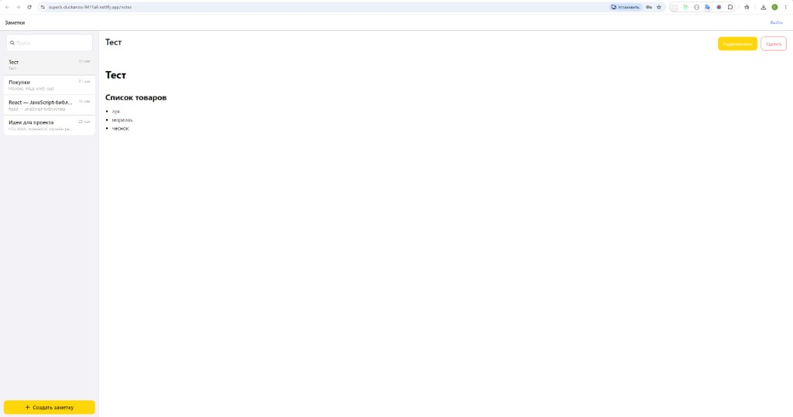
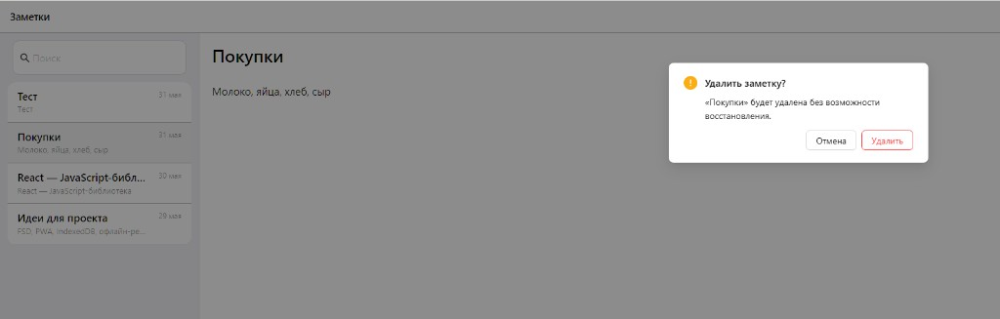
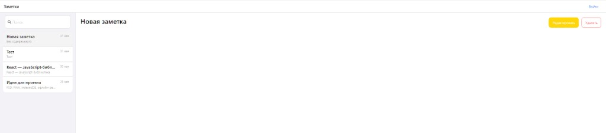

# Заметки

Веб-приложение «Заметки» в стиле macOS: создание, поиск и редактирование заметок с поддержкой Markdown, офлайн-режима и установки как PWA.

**Демо:** [superb-duckanoo-9411a6.netlify.app](https://superb-duckanoo-9411a6.netlify.app)

| Логин | Пароль |
|-------|--------|
| `demo` | `demo` |

## Скриншоты

### Просмотр заметки с Markdown



Заметка отображается в режиме чтения: заголовок, списки и форматирование рендерятся из Markdown.

### Подтверждение удаления



Перед удалением показывается модальное окно с предупреждением — случайно удалить заметку нельзя.

### Новая заметка



Список заметок в боковой панели, рабочая область справа и кнопки «Редактировать» / «Удалить».

## Возможности

- **Авторизация** — простой вход по логину и паролю (демо-учётная запись)
- **CRUD заметок** — создание, просмотр, редактирование и удаление
- **Markdown** — ввод в редакторе, просмотр с рендерингом через `marked` + санитизация `DOMPurify`
- **Автосохранение** — изменения сохраняются в IndexedDB с задержкой 500 мс
- **Поиск** — фильтрация заметок по заголовку и содержимому
- **Офлайн** — данные хранятся локально в браузере (Dexie / IndexedDB)
- **PWA** — можно установить на рабочий стол и работать без сети после первой загрузки

## Стек

| Категория | Технологии |
|-----------|------------|
| UI | React 19, TypeScript, SCSS, Ant Design |
| Состояние | Redux Toolkit (RTK Query) |
| Маршрутизация | React Router |
| Хранилище | Dexie (IndexedDB) |
| PWA | vite-plugin-pwa, Workbox |
| Сборка | Vite 8, React Compiler |

## Архитектура

Проект организован по [Feature-Sliced Design](https://feature-sliced.design/):

```
src/
├── app/        # провайдеры, роутер, store, layout
├── pages/      # login, notes
├── widgets/    # header, sidebar, workspace
├── feature/    # create-note, note-editor, note-list, search
├── features/   # auth
├── entities/   # note, session
└── shared/     # ui, lib, config, styles
```

## Быстрый старт

```bash
# установка зависимостей
npm install

# режим разработки
npm run dev

# production-сборка
npm run build

# локальный просмотр сборки (для проверки PWA)
npm run preview
```

Приложение откроется на `http://localhost:5173` (dev) или `http://localhost:4173` (preview).

## Проверка PWA локально

Service worker генерируется только в production-сборке:

1. `npm run build && npm run preview`
2. Откройте DevTools → **Application** → проверьте **Manifest** и **Service Workers**
3. Включите **Offline** и обновите страницу — приложение должно продолжить работать

## Скрипты

| Команда | Описание |
|---------|----------|
| `npm run dev` | Dev-сервер с HMR |
| `npm run build` | TypeScript + production-сборка |
| `npm run preview` | Локальный сервер для `dist/` |
| `npm run lint` | ESLint |

## Лицензия

MIT
